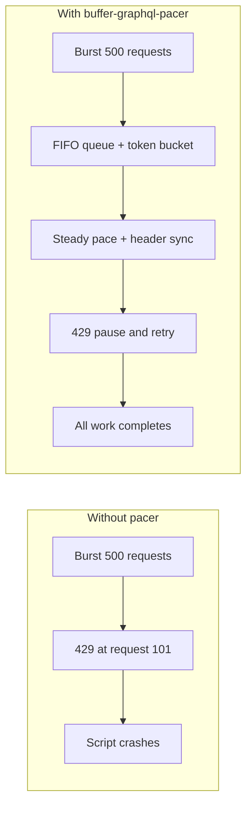

# buffer-graphql-pacer

Open-source **batching and pacing proxy** for [Buffer](https://buffer.com/)’s GraphQL API. Queue bursty traffic, stay under the rolling **100 requests / 15 minutes** limit, and recover from HTTP 429 without half-finished bulk jobs.

## The problem

Agencies, AI pipelines, and cron scripts often fire 100+ GraphQL calls in seconds. Buffer responds with **HTTP 429** on a **rolling** window—not a fixed `sleep(60)` interval. Scripts crash mid-run; posts are half-scheduled; local state drifts from Buffer.

## The solution



| Signal                  | Behavior                                                     |
| ----------------------- | ------------------------------------------------------------ |
| Token bucket            | Proactive pace (~90 req / 15 min with default safety margin) |
| `RateLimit-*` headers   | Slow down when `Remaining` is low                            |
| HTTP 429 + `retryAfter` | Pause queue, retry automatically                             |

## Install

```bash
pnpm add buffer-graphql-pacer
# or: npm install buffer-graphql-pacer
```

Requires **Node.js 20+** (24 recommended for local dev — see `.nvmrc`).

## Quick start

### `fetch` (recommended — full header + 429 handling)

```typescript
import { BufferRateLimiter, createBufferedFetch } from 'buffer-graphql-pacer'

const limiter = new BufferRateLimiter()

const response = await createBufferedFetch(limiter)('https://graph.buffer.com/graphql', {
  method: 'POST',
  headers: {
    Authorization: `Bearer ${process.env.BUFFER_ACCESS_TOKEN}`,
    'Content-Type': 'application/json',
  },
  body: JSON.stringify({
    query: `{ organizations { id name } }`,
  }),
})

console.log(limiter.getState())
```

### graphql-request

```typescript
import { GraphQLClient } from 'graphql-request'
import { BufferRateLimiter, createGraphqlRequestFetch } from 'buffer-graphql-pacer'

const limiter = new BufferRateLimiter()
const client = new GraphQLClient(url, { fetch: createGraphqlRequestFetch(limiter) })

await client.request(`{ organizations { id name } }`)
```

### Apollo Client

```typescript
import { ApolloClient, HttpLink, InMemoryCache } from '@apollo/client/core'
import { BufferRateLimiter, createBufferedFetch } from 'buffer-graphql-pacer'

const limiter = new BufferRateLimiter()

const client = new ApolloClient({
  link: new HttpLink({
    uri: 'https://graph.buffer.com/graphql',
    fetch: createBufferedFetch(limiter),
  }),
  cache: new InMemoryCache(),
})
```

For queue-only pacing without wrapping `fetch`:

```typescript
import { BufferPacingLink } from 'buffer-graphql-pacer/apollo'
```

## API surface

| Export                      | Purpose                                                   |
| --------------------------- | --------------------------------------------------------- |
| `BufferRateLimiter`         | `schedule(fn)` — core queue + pacing                      |
| `createBufferedFetch`       | Drop-in paced `fetch`                                     |
| `createGraphqlRequestFetch` | `GraphQLClient` `fetch` option                            |
| `BufferPacingLink`          | Apollo link (`buffer-graphql-pacer/apollo`)               |
| `getState()`                | `queueDepth`, tokens, `pausedUntil`, `rateLimitRemaining` |

Defaults match Buffer’s documented limit: **100 requests / 15 minutes**, **0.9 safety margin**.

## Testing strategy

| Tier                   | Tool                         | When                                   |
| ---------------------- | ---------------------------- | -------------------------------------- |
| **1 — CI / TDD**       | MSW mock in `pnpm test`      | Every commit; finishes in seconds      |
| **2 — Live read-only** | `pnpm example:live:readonly` | Manual; harmless `organizations` query |
| **3 — Live Ideas**     | `pnpm example:live:ideas`    | Optional; `createIdea` scratchpad only |

**Do not** soak-test with post/draft mutations on live channels.

```bash
# CI-safe (no network)
pnpm test

# Local demo (uses your URL if set — see examples)
pnpm example:paced

# Live read-only flood (consumes real quota)
cp .env.example .env   # set token, url, RUN_LIVE_TESTS=1
pnpm example:live:readonly
FLOOD_MODE=unpaced pnpm example:live:readonly   # expect 429s
FLOOD_MODE=paced pnpm example:live:readonly       # limiter absorbs burst
```

## Development

```bash
pnpm install
pnpm test
pnpm typecheck
pnpm lint
pnpm build
```

See [CONTRIBUTING.md](./CONTRIBUTING.md) and [docs/IMPLEMENTATION_PLAN.md](./docs/IMPLEMENTATION_PLAN.md).

## License

MIT — see [LICENSE](./LICENSE).
