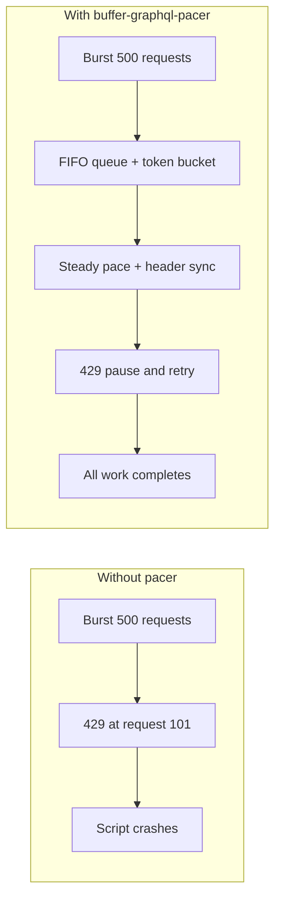

# buffer-graphql-pacer

Open-source **batching and pacing proxy** for [Buffer](https://buffer.com/)’s GraphQL API. Queue bursty traffic, stay under the rolling **100 requests / 15 minutes** limit, and recover from HTTP 429 without half-finished bulk jobs.

**Repository:** [github.com/chauhannishith/buffer-graphql-pacer](https://github.com/chauhannishith/buffer-graphql-pacer)


## The problem

Agencies, AI pipelines, and cron scripts often fire 100+ GraphQL calls in seconds. Buffer responds with **HTTP 429** on a **rolling** window—not a fixed `sleep(60)` interval. Scripts crash mid-run; posts are half-scheduled; local state drifts from Buffer.

## The solution



| Signal                  | Behavior                                                     |
| ----------------------- | ------------------------------------------------------------ |
| Token bucket            | Proactive pace (~90 req / 15 min with default safety margin) |
| `RateLimit-*` headers   | Slow down when `Remaining` is low                            |
| HTTP 429 + `retryAfter` | Pause queue, retry automatically                             |

## Install

```bash
pnpm add buffer-graphql-pacer
# or: npm install buffer-graphql-pacer
```

**Not on npm yet?** Install from GitHub until the first release is published:

```bash
pnpm add github:chauhannishith/buffer-graphql-pacer
# or: npm install github:chauhannishith/buffer-graphql-pacer
```

The `prepare` script builds `dist/` automatically during install — no manual build step on your side (first install may take a minute).

Requires **Node.js 20+** (24 recommended for local dev — see `.nvmrc`).

## Quick start

### `fetch` (recommended — full header + 429 handling)

```typescript
import { BufferRateLimiter, createBufferedFetch } from 'buffer-graphql-pacer'

const limiter = new BufferRateLimiter()

const response = await createBufferedFetch(limiter)('https://graph.buffer.com/graphql', {
  method: 'POST',
  headers: {
    Authorization: `Bearer ${process.env.BUFFER_ACCESS_TOKEN}`,
    'Content-Type': 'application/json',
  },
  body: JSON.stringify({
    query: `{ organizations { id name } }`,
  }),
})

console.log(limiter.getState())
```

### graphql-request

```typescript
import { GraphQLClient } from 'graphql-request'
import { BufferRateLimiter, createGraphqlRequestFetch } from 'buffer-graphql-pacer'

const limiter = new BufferRateLimiter()
const client = new GraphQLClient(url, { fetch: createGraphqlRequestFetch(limiter) })

await client.request(`{ organizations { id name } }`)
```

### Apollo Client

```typescript
import { ApolloClient, HttpLink, InMemoryCache } from '@apollo/client/core'
import { BufferRateLimiter, createBufferedFetch } from 'buffer-graphql-pacer'

const limiter = new BufferRateLimiter()

const client = new ApolloClient({
  link: new HttpLink({
    uri: 'https://graph.buffer.com/graphql',
    fetch: createBufferedFetch(limiter),
  }),
  cache: new InMemoryCache(),
})
```

For queue-only pacing without wrapping `fetch`:

```typescript
import { BufferPacingLink } from 'buffer-graphql-pacer/apollo'
```

## Production usage

Use the library as an **in-process pacing layer** — not a standalone proxy service. One Node process, one shared limiter, all Buffer GraphQL traffic routed through it.

### Checklist

| Do                                                                          | Don't                                           |
| --------------------------------------------------------------------------- | ----------------------------------------------- |
| Create **one `BufferRateLimiter` per process** and reuse it                 | Spin up a new limiter per request               |
| Use `createBufferedFetch(limiter)` or `limiter.schedule()`                  | Import `buffer-graphql-pacer/tui` in production |
| Load `BUFFER_ACCESS_TOKEN` from env / secrets manager                       | Commit tokens or hard-code credentials          |
| `await Promise.all([...])` and let the queue drain                          | Fire-and-forget without awaiting scheduled work |
| Set `maxTransientRetries: 0` for **mutations** unless writes are idempotent | Blindly retry `createPost`-style calls          |
| Log `limiter.getState()` or use callbacks on long jobs                      | Assume multi-server deployments share one quota |

### Recommended pattern (cron, worker, script)

```typescript
import { BufferRateLimiter, createBufferedFetch } from 'buffer-graphql-pacer'

const limiter = new BufferRateLimiter({
  // Safer default for createPost / createIdea / other writes
  maxTransientRetries: 0,
  callbacks: {
    onPause: ({ retryAfterSeconds }) => {
      console.warn(`Buffer 429 — pausing ${retryAfterSeconds}s`)
    },
  },
})

const bufferFetch = createBufferedFetch(limiter)

const graphqlUrl = process.env.BUFFER_GRAPHQL_URL!
const token = process.env.BUFFER_ACCESS_TOKEN!

export async function runBulkJob(items: unknown[]) {
  const responses = await Promise.all(
    items.map((item) =>
      bufferFetch(graphqlUrl, {
        method: 'POST',
        headers: {
          Authorization: `Bearer ${token}`,
          'Content-Type': 'application/json',
        },
        body: JSON.stringify({ query: MUTATION, variables: { input: item } }),
      }),
    ),
  )

  const failed = responses.filter((response) => !response.ok)
  if (failed.length > 0) {
    throw new Error(`${failed.length} Buffer requests failed`)
  }

  return responses
}
```

Schedule as many calls as you need up front — the limiter serializes execution and spaces requests. A job with 200 items may run for many minutes; that is expected.

### graphql-request or Apollo in production

```typescript
import { GraphQLClient } from 'graphql-request'
import { BufferRateLimiter, createGraphqlRequestFetch } from 'buffer-graphql-pacer'

const limiter = new BufferRateLimiter({ maxTransientRetries: 0 })

export const bufferClient = new GraphQLClient(process.env.BUFFER_GRAPHQL_URL!, {
  fetch: createGraphqlRequestFetch(limiter),
  headers: { Authorization: `Bearer ${process.env.BUFFER_ACCESS_TOKEN}` },
})
```

Reuse `bufferClient` (and the same `limiter`) for the lifetime of the process.

### Multiple servers or processes

Each process has its **own** token bucket and queue. Two cron jobs on different machines each pace locally — they do **not** coordinate. Split work at the application layer, run one pacer per worker, or centralize Buffer calls through a single worker if you must stay under a shared account limit.

### Observability

```typescript
const limiter = new BufferRateLimiter({
  callbacks: {
    onRateLimitHeaders: (snapshot) => {
      console.info('RateLimit-Remaining', snapshot.remaining)
    },
    onTransientRetry: ({ reason, attempt, delayMs }) => {
      console.warn(`Retry ${attempt} after ${reason}, waiting ${delayMs}ms`)
    },
  },
})

// Or poll during a long run
console.info(limiter.getState())
// queueDepth, rateLimitRemaining, pacingStatus, pausedUntil, …
```

### Known limits

- **Rolling window:** Proactive pacing uses a token bucket (~90 req / 15 min with defaults), not a perfect sliding-window counter. Header sync and 429 handling cover the gap in most cases.
- **Daily quota:** Buffer plans may enforce a separate daily cap (e.g. free tier). Exhausted daily quota returns errors before HTTP 429 — pacing cannot fix that.
- **Live validation:** MSW tests cover burst and 429 recovery in CI. Soak-test against the real API when you have quota headroom (`pnpm example:live:readonly`).

## API surface

| Export                      | Purpose                                                                                                    |
| --------------------------- | ---------------------------------------------------------------------------------------------------------- |
| `BufferRateLimiter`         | `schedule(fn)` — core queue + pacing                                                                       |
| `createBufferedFetch`       | Drop-in paced `fetch`                                                                                      |
| `createGraphqlRequestFetch` | `GraphQLClient` `fetch` option                                                                             |
| `BufferPacingLink`          | Apollo link (`buffer-graphql-pacer/apollo`)                                                                |
| `getState()`                | `queueDepth`, tokens, `pausedUntil`, `pauseReason`, `totalSucceeded`, `totalFailed`, `httpStatusCounts`, … |

Defaults match Buffer’s documented limit: **100 requests / 15 minutes**, **0.9 safety margin**.

### Transient failure retries

`BufferRateLimiter` retries flaky work automatically:

| Failure                        | Behavior                                                                                    |
| ------------------------------ | ------------------------------------------------------------------------------------------- |
| Network error (`fetch` throws) | Up to 3 retries with exponential backoff; **token refunded** (request never reached Buffer) |
| HTTP 5xx                       | Same backoff retries (request reached the server)                                           |
| HTTP 4xx (except 401/429)      | Global pause + exponential retry (5 min → 24 h) on **first failure**; blocks the queue      |
| HTTP 200 + GraphQL `errors`    | Same failure backoff (common for quota messages in the body)                                |
| HTTP 401                       | Fail fast — no retry (auth will not recover with waiting)                                   |
| HTTP 429                       | Global pause + retry (unchanged)                                                            |

`totalCompleted` tracks finished jobs; `totalSucceeded` / `totalFailed` and `httpStatusCounts` distinguish successes from failures. Disable with `failureBackoff: { enabled: false }` (alias: `quotaExhaustionBackoff`).

Buffer mutations may not be idempotent — use retries cautiously on write operations, or disable with `maxTransientRetries: 0`.

## Terminal dashboard (opt-in)

The core limiter (`createBufferedFetch`, `BufferRateLimiter`) **never** shows a terminal UI. The dashboard is a separate optional layer — **disabled by default**.

```typescript
import { BufferRateLimiter, createBufferedFetch } from 'buffer-graphql-pacer'
import { runPacedWork } from 'buffer-graphql-pacer/tui'

const limiter = new BufferRateLimiter()
const fetch = createBufferedFetch(limiter)

// dashboard: false (default) — silent pacing for production scripts
await runPacedWork(limiter, () => scheduleAllPosts(fetch), { dashboard: false })

// dashboard: true — terminal UI for local dev or demos
await runPacedWork(limiter, () => scheduleAllPosts(fetch), {
  dashboard: true,
  title: 'BUFFER RATE OPTIMIZER',
  itemLabel: 'Posts',
})
```

```bash
# MSW demo (no API token — great for GIFs)
pnpm example:dashboard
FLOOD_COUNT=80 pnpm example:dashboard

# Live read-only with dashboard (example script uses DASHBOARD=1)
RUN_LIVE_TESTS=1 DASHBOARD=1 pnpm example:live:readonly
```

The equalizer bars spike during bursts and flatten when `RateLimit-Remaining` is low or the limiter pauses on HTTP 429.

## Testing strategy

| Tier                   | Tool                         | When                                   |
| ---------------------- | ---------------------------- | -------------------------------------- |
| **1 — CI / TDD**       | MSW mock in `pnpm test`      | Every commit; finishes in seconds      |
| **2 — Live read-only** | `pnpm example:live:readonly` | Manual; harmless `organizations` query |
| **3 — Live Ideas**     | `pnpm example:live:ideas`    | Optional; `createIdea` scratchpad only |

**Do not** soak-test with post/draft mutations on live channels.

```bash
# CI-safe (no network)
pnpm test

# Local demo (uses your URL if set — see examples)
pnpm example:paced

# Live read-only flood (consumes real quota)
cp .env.example .env   # set BUFFER_ACCESS_TOKEN, BUFFER_GRAPHQL_URL, RUN_LIVE_TESTS=1
pnpm example:live:readonly   # npm script passes --env-file=.env to tsx
FLOOD_MODE=unpaced pnpm example:live:readonly   # expect 429s
FLOOD_MODE=paced pnpm example:live:readonly       # limiter absorbs burst
DASHBOARD=1 pnpm example:live:readonly          # paced + terminal UI
```

## Development

```bash
pnpm install
pnpm test
pnpm typecheck
pnpm lint
pnpm build
```

See [CONTRIBUTING.md](./CONTRIBUTING.md) and [docs/IMPLEMENTATION_PLAN.md](./docs/IMPLEMENTATION_PLAN.md).

## License

MIT — see [LICENSE](./LICENSE).
