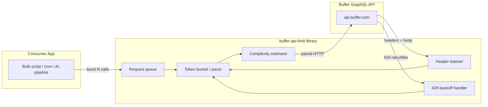
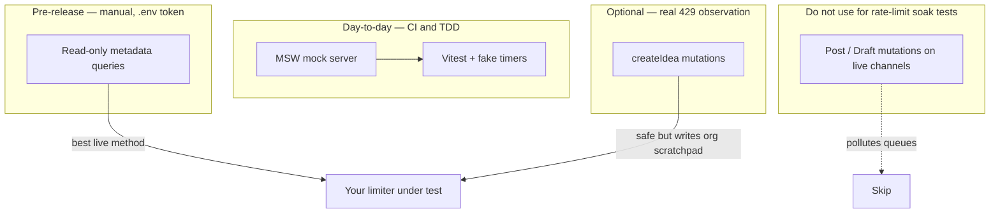

# Buffer API Rate-Limit Proxy — Implementation Plan

A production-grade, open-source **batching and pacing layer** for Buffer’s GraphQL API. This document turns the README vision into a buildable roadmap: tech stack, architecture, phased delivery, real-world adoption, and how to present the project for hiring.

---

## 1. Problem Statement

| Constraint                    | Value                                                             |
| ----------------------------- | ----------------------------------------------------------------- |
| Window                        | Rolling **15 minutes** per client application                     |
| Cap                           | **100 requests** per window                                       |
| Steady-state pace             | ~**6.67 requests/minute** (100 ÷ 15)                              |
| Over-limit response           | **HTTP 429** + JSON `retryAfter` (seconds)                        |
| Response headers (every call) | `RateLimit-Limit`, `RateLimit-Remaining`, `RateLimit-Reset` (UTC) |

**Failure mode today:** Bulk schedulers (agencies, AI content pipelines, cron jobs) fire dozens or hundreds of mutations in seconds. Request #101 triggers 429; partial writes leave schedules and local DB out of sync. Fixed `sleep()` does not work on a **rolling** window—you must pace using headers and reset times.

**What we build:** A drop-in library that accepts bursty traffic, queues work, drains at a safe rate, adapts from live headers, and recovers cleanly from 429s.

---

## 2. Goals and Non-Goals

### Goals

- Never exceed Buffer’s per-app rate limit under normal use (proactive pacing).
- Recover automatically after 429 using `retryAfter` and header state.
- Optional awareness of GraphQL **query complexity** (Buffer scores fields/objects/depth).
- Zero or one-line integration with common Node GraphQL clients.
- Strong test story: **three-tier testing** — MSW for daily TDD, harmless read-only queries for live validation, `createIdea` only when you must observe a real 429 without touching live channels.
- Documentation and diagrams suitable for **open-source adoption** and **portfolio review**.

### Non-Goals (v1)

- Hosted SaaS proxy or multi-tenant cloud service.
- UI dashboard.
- Support for non-Buffer APIs (keep scope tight; design for extension later).
- Persistent queue across process restarts (in-memory v1; document Redis adapter as v2).

---

## 3. Recommended Tech Stack

| Layer                     | Choice                                                         | Rationale                                                                                       |
| ------------------------- | -------------------------------------------------------------- | ----------------------------------------------------------------------------------------------- |
| Language                  | **TypeScript** (strict)                                        | Standard for OSS middleware; matches Buffer’s JS/Node audience                                  |
| Runtime                   | **Node.js 20+**                                                | LTS, native `fetch`, stable test tooling                                                        |
| Package manager           | **pnpm** (or npm)                                              | Fast workspaces if we add `examples/` later                                                     |
| Build                     | **tsup** or **unbuild**                                        | ESM + CJS dual publish for libraries                                                            |
| Test                      | **Vitest**                                                     | Fast unit tests, fake timers for pacing                                                         |
| HTTP mocking              | **MSW** (primary)                                              | Simulates Buffer headers + 429 with `retryAfter: 5` so suites finish in seconds, not 15 minutes |
| Lint/format               | **ESLint + Prettier**                                          | Expected in OSS repos                                                                           |
| CI                        | **GitHub Actions**                                             | Test on PR; publish on tag                                                                      |
| Docs site (optional v1.1) | **VitePress** or README-only                                   | README-first for week 1                                                                         |
| Registry                  | **npm** (`@scope/buffer-rate-limit` or `buffer-graphql-pacer`) | Discoverability                                                                                 |

**Integration surfaces (implement in this order):**

1. **Core:** `BufferRateLimiter` class + `enqueue(fn)` API (framework-agnostic).
2. **Fetch wrapper:** `createBufferedFetch(baseFetch?)` for any GraphQL over HTTP.
3. **graphql-request:** `wrapClient(client)` or custom `fetch` option.
4. **Apollo Client:** `ApolloLink` (`BufferPacingLink`).
5. **Examples:** CLI script that schedules N dummy posts (README hero demo).

---

## 4. High-Level Architecture



### Core patterns

1. **Leaky / token bucket queue** — Producers push async jobs; a single drain loop (or worker pool of size 1 for v1) executes at `min(configuredPace, headerInferredPace)`.
2. **Stateful header listener** — After each success, update: `remaining`, `resetAt`, derived `safeRps`. If `remaining` is low, tighten pace; after `resetAt`, refill budget.
3. **Complexity gate (optional)** — Before send, estimate query cost; if window budget is points-based, delay or split batch.

---

## 5. Repository Structure

```
buffer-api-limit/
├── src/
│   ├── index.ts                 # Public exports
│   ├── limiter.ts               # BufferRateLimiter orchestration
│   ├── queue/
│   │   ├── token-bucket.ts      # Refill / consume math
│   │   └── job-queue.ts         # FIFO + priorities (optional)
│   ├── headers/
│   │   └── rate-limit-state.ts  # Parse & store RateLimit-* headers
│   ├── backoff/
│   │   └── retry-429.ts         # Freeze queue on retryAfter
│   ├── parser/
│   │   └── complexity.ts        # GraphQL cost estimator (AST or heuristic)
│   └── adapters/
│       ├── fetch.ts
│       ├── apollo-link.ts
│       └── graphql-request.ts
├── tests/
│   ├── mocks/
│   │   └── buffer-api.ts        # MSW handler: virtual 100-cap, headers, 429 on #101
│   ├── token-bucket.test.ts
│   ├── header-sync.test.ts
│   ├── burst-500.test.ts        # Runs against MSW only (CI-safe)
│   ├── pacing-429.test.ts       # Mock 429 + short retryAfter; fake timers
│   └── adapter-fetch.test.ts
├── examples/
│   ├── flood-readonly.ts        # Live: hammer getOrganizations (~110 calls)
│   ├── flood-ideas.ts           # Live: hammer createIdea (~120 calls) — no live channels
│   ├── bulk-schedule-paced.ts   # Same flood, but through limiter (hero demo)
│   └── apollo-setup.ts
├── IMPLEMENTATION_PLAN.md       # This file
├── README.md                    # User-facing: problem, install, diagrams
├── LICENSE                      # MIT (max adoption)
├── package.json
└── .github/workflows/ci.yml
```

---

## 6. Public API (Draft)

```typescript
// Core
const limiter = new BufferRateLimiter({
  maxRequestsPerWindow: 100,
  windowMs: 15 * 60 * 1000,
  safetyMargin: 0.9, // target 90 req / 15 min to leave headroom
  concurrency: 1, // v1: single flight avoids header races
})

await limiter.schedule(() => fetch(bufferUrl, { method: 'POST', body }))

// Fetch adapter
const bufferedFetch = createBufferedFetch({ limiter })
const res = await bufferedFetch(url, init)

// Apollo
const link = from([new BufferPacingLink({ limiter }), httpLink])
```

**Configuration principles:**

- Defaults match Buffer docs; overrides for integration tests only.
- Expose `limiter.getState()` for logging: `{ remaining, resetAt, queueDepth, pausedUntil }`.
- Events: `onPause`, `onResume`, `onRateLimitHeaders` for observability hooks.

---

## 7. Mathematical Pacing (Day 1–2 Detail)

### Baseline rate

- **Target interval between requests:** `windowMs / (maxRequests × safetyMargin)`  
  Example: `900_000 / (100 × 0.9) ≈ 10_000 ms` (~6 req/min with margin).

### Token bucket

- **Capacity:** `maxRequests × safetyMargin` tokens.
- **Refill:** Continuous refill at `capacity / windowMs` tokens/ms, capped at capacity.
- **Consume:** 1 token per HTTP request (v1); v1.1: consume `estimatedComplexity` tokens if Buffer enforces points.

### Header-driven adjustment

After each response:

```
remaining = parseInt(RateLimit-Remaining)
resetAt   = new Date(RateLimit-Reset)
limit     = parseInt(RateLimit-Limit)

if remaining <= lowWatermark (e.g. 5):
  pace = max(intervalBaseline, (resetAt - now) / remaining)

if 429:
  pauseUntil = now + retryAfterSeconds * 1000
  drain loop sleeps until pauseUntil
```

### Why not `sleep(60)`?

Rolling window: the **oldest** request in the window falls off continuously. The limiter tracks server truth via headers instead of guessing.

---

## 8. GraphQL Complexity Analyzer (Day 3)

Buffer-style scoring (from README; validate against current docs when implementing):

| Rule         | Points                    |
| ------------ | ------------------------- |
| Scalar field | 1                         |
| Object field | 2                         |
| Nested depth | ×1.5 multiplier per level |

**Implementation options:**

1. **Lightweight:** Regex/heuristic on query string for demos (fast, good enough for docs).
2. **Accurate:** `graphql` `parse()` + walk AST, sum fields with depth multiplier.

**Behavior:** If `estimatedCost + consumedThisWindow > budget`, defer job until next refill or split into smaller queries (document limitation in README).

---

## 9. Retry and Backoff (Day 4)

| Scenario      | Behavior                                                                                                  |
| ------------- | --------------------------------------------------------------------------------------------------------- |
| HTTP 429      | Parse `retryAfter`, set global `pausedUntil`, reject or re-queue in-flight with same idempotency key docs |
| Network error | Exponential backoff with jitter, max 3 retries, does not consume rate tokens until sent                   |
| 4xx (non-429) | Fail fast, do not retry                                                                                   |
| 5xx           | Limited retries, respect pause state                                                                      |

**Queue freeze:** While paused, drain loop idle; new jobs still enqueue (backpressure: optional `maxQueueSize`).

**Idempotency note for docs:** Buffer mutations may not be idempotent; recommend consumer-supplied keys or dedupe at app layer—library documents this clearly.

---

## 10. Testing Strategy (Day 5)

### The practical hurdle

Developers need to prove pacing and 429 recovery against a **100-request / 15-minute** window without:

- Spamming real social channels with draft posts
- Waiting 15 minutes between every local dev iteration
- Burning production API quota in CI

Buffer’s API shape gives us a clean **three-tier pyramid**: fast mocks for daily work, harmless read-only traffic for live header validation, and Ideas mutations only when you need to see a real 429 on the wire.



### Tier 1 — Code-level mock (default for TDD and CI)

**Tool:** MSW (Mock Service Worker) in `tests/mocks/buffer-api.ts`, registered in Vitest setup.

**Simulated Buffer behavior:**

| Call # | Response                                                                                                                                          |
| ------ | ------------------------------------------------------------------------------------------------------------------------------------------------- |
| 1–100  | `200` + headers `RateLimit-Limit: 100`, decrementing `RateLimit-Remaining`, `RateLimit-Reset` (UTC ~15 min ahead, or compressed with fake timers) |
| 101+   | `429` + body `{ "retryAfter": 5 }` (use **5 seconds** in mocks, not 15 minutes)                                                                   |

**What this proves in under 10 seconds:**

- Token bucket never sends call 101 when pacing is enabled
- Header listener tightens drain as `RateLimit-Remaining` falls
- On mock 429, queue freezes for `retryAfter`, then resumes
- burst-500: enqueue 500 jobs against MSW; paced run completes with zero unhandled 429

**Unit tests (Vitest):**

| Test              | Purpose                                               |
| ----------------- | ----------------------------------------------------- |
| Token bucket math | Refill, burst, safety margin                          |
| Header sync       | MSW decrements `Remaining`; drain slows               |
| pacing-429        | Mock 429 + `retryAfter: 5` + `vi.advanceTimersByTime` |
| burst-500         | 500 enqueued; paced vs unpaced comparison             |
| Adapter contract  | `createBufferedFetch` forwards method/body/headers    |

**CI policy:** `pnpm test` runs **mock tier only**. No network, no secrets.

---

### Tier 2 — Live read-only queries (best real API method)

Rate limits count **every GraphQL request**, including read-only metadata fetches. You can exhaust the window without creating posts or touching live channel queues.

**Recommended soak script:** `examples/flood-readonly.ts`

```graphql
query GetOrgMetaData {
  organizations {
    id
    name
  }
}
```

**Manual procedure:**

1. Set `BUFFER_ACCESS_TOKEN` in `.env` (never commit).
2. Run **without** the limiter: loop ~110 requests in ~10 seconds → observe `RateLimit-Remaining` drop, hard 429 on request #101.
3. Run **with** the limiter (`examples/bulk-schedule-paced.ts`): same loop → queue absorbs burst, no crash, no partial-failure chaos.

**Why this is the best live test:**

- Harmless: no spam, no edits to publish queues
- Exercises real `RateLimit-*` headers and real `retryAfter` JSON
- Ideal final validation before npm publish or demo recording

**Guardrails in docs:**

- Mark as `@manual` / `pnpm test:live:readonly` — skipped in CI
- Print remaining quota before/after
- Warn: consumes your real 100-request window; wait for `RateLimit-Reset` before re-running

---

### Tier 3 — Live `createIdea` mutations (safe 429 trigger with writes)

Buffer splits content into two buckets:

| Bucket             | API surface                            | Risk for soak tests                              |
| ------------------ | -------------------------------------- | ------------------------------------------------ |
| **Posts / Drafts** | Tied to live channels (LinkedIn, etc.) | **High** — pollutes real queues                  |
| **Ideas**          | `createIdea` — internal org scratchpad | **Low** — never publishes until a human promotes |

The rolling limit applies to **any** call to `api.buffer.com`, so you _can_ fire ~120 rapid `createIdea` mutations to trigger a real 429 and capture headers—without touching live social accounts.

**Script:** `examples/flood-ideas.ts` (manual only, documented cleanup)

Use when you need to demonstrate end-to-end mutation pacing on video or in a Buffer-facing portfolio review. Prefer Tier 2 for routine pre-release checks.

---

### What not to use for rate-limit testing

- **Post / draft mutations** on connected channels — even in draft state, they clutter real workflows and look unprofessional in a demo org.
- **Hammering the live API in CI** — slow, flaky, burns shared tokens, violates principle of least surprise for contributors.

---

### Test commands (target `package.json` scripts)

| Script                    | Tier                    | When                               |
| ------------------------- | ----------------------- | ---------------------------------- |
| `pnpm test`               | MSW + Vitest            | Every commit / CI                  |
| `pnpm test:live:readonly` | Real `getOrganizations` | Manual pre-release                 |
| `pnpm test:live:ideas`    | Real `createIdea`       | Optional; real 429 + mutation path |
| `pnpm example:paced`      | MSW or live (flag)      | README hero demo                   |

---

### Environment and fixtures

```bash
# .env.example (live tiers only)
BUFFER_ACCESS_TOKEN=
BUFFER_GRAPHQL_URL=https://graph.buffer.com/...  # confirm from current docs
RUN_LIVE_TESTS=0                                  # must be 1 to run flood-* scripts
```

Record **fixture snapshots** (redacted headers JSON) from one Tier 2 run into `tests/fixtures/rate-limit-headers.json` so MSW stays aligned with production header shapes.

---

## 11. Phased Implementation Timeline

Aligned with README (~15–20 hours / 5–7 days). Adjust if complexity analyzer is deferred to v1.1.

| Phase                 | Days | Deliverable                                                | Exit criteria                         |
| --------------------- | ---- | ---------------------------------------------------------- | ------------------------------------- |
| **0. Scaffold**       | 0.5  | Repo, TS, Vitest, CI, MIT LICENSE                          | `pnpm test` green                     |
| **1. Queue + bucket** | 1–2  | `BufferRateLimiter`, job queue, drain loop                 | 100 jobs complete in mock without 429 |
| **2. Headers**        | 0.5  | Parse/sync `RateLimit-*`                                   | Pace tightens when remaining low      |
| **3. 429 backoff**    | 1    | Pause/resume from body + headers                           | Recovery test passes                  |
| **4. Complexity**     | 1    | AST estimator + optional gate                              | Unit tests for sample queries         |
| **5. Tests**          | 1    | MSW mock + burst-500 + pacing-429; `flood-readonly` script | CI &lt;10s; live script documented    |
| **6. Adapters**       | 1    | fetch + graphql-request + Apollo link                      | `bulk-schedule-paced` runs on MSW     |
| **7. Docs + polish**  | 1–2  | README testing pyramid, API reference                      | npm publish-ready                     |
| **8. Portfolio**      | 0.5  | Demo GIF (paced vs unpaced readonly flood), blog outline   | Shareable link                        |

**Suggested git commit sequence (for portfolio clarity):**

1. `chore: scaffold typescript library and ci`
2. `feat: token bucket queue and drain loop`
3. `feat: sync pacing from RateLimit response headers`
4. `feat: handle 429 retryAfter with queue pause`
5. `feat: estimate graphql query complexity`
6. `test: add msw buffer mock, burst-500, and pacing-429 tests`
7. `feat: add fetch and apollo adapters`
8. `test: add manual flood-readonly and optional flood-ideas examples`
9. `docs: readme with testing pyramid and before/after diagrams`

---

## 12. Real-World Use Cases

| User                    | Scenario                                           | How they use the library                                                  |
| ----------------------- | -------------------------------------------------- | ------------------------------------------------------------------------- |
| **Agency**              | Monday batch: 50 clients × 7 days of posts         | Wrap existing Node scheduler; all mutations go through `limiter.schedule` |
| **AI content pipeline** | LLM outputs 200 captions → Buffer create mutations | Single process queue; logs `getState()` to Datadog                        |
| **SaaS integrator**     | Multi-tenant app, one Buffer OAuth app             | One limiter **per Buffer client_id** (document singleton pattern)         |
| **Cron job**            | Nightly sync                                       | Process starts, drains queue, exits when empty                            |
| **Local dev**           | Script testing                                     | MSW mock by default; live readonly only when `RUN_LIVE_TESTS=1`           |

**Operational practices:**

- One limiter instance per Buffer **application** (API key / OAuth client), not per end-user.
- Persist job IDs in your DB as `pending | scheduled | failed`; library only handles transport pacing.
- Combine with Buffer webhooks (if available) for confirmation, not as substitute for rate control.

---

## 13. Open-Source Integration Guide (For Third Parties)

### Install

```bash
npm install buffer-graphql-pacer
# or
pnpm add buffer-graphql-pacer
```

### Minimal integration (fetch)

```typescript
import { BufferRateLimiter, createBufferedFetch } from 'buffer-graphql-pacer'

const limiter = new BufferRateLimiter()
const fetch = createBufferedFetch({ limiter })

const response = await fetch('https://graph.buffer.com/...', {
  method: 'POST',
  headers: { Authorization: `Bearer ${token}`, 'Content-Type': 'application/json' },
  body: JSON.stringify({ query, variables }),
})
```

### Apollo Client

```typescript
import { BufferPacingLink } from 'buffer-graphql-pacer/apollo'

const client = new ApolloClient({
  link: from([new BufferPacingLink(), httpLink]),
  cache: new InMemoryCache(),
})
```

### Extension points (document for contributors)

- `StorageAdapter` — plug Redis for cross-process queue (v2).
- `Logger` — `pino` / `console` injection.
- `Metrics` — OpenTelemetry counters: `buffer_pacer_queue_depth`, `buffer_pacer_delay_ms`.

### Governance

- **MIT license**
- `CONTRIBUTING.md`: conventional commits, test required for pacing logic changes
- Semantic versioning: breaking changes only in major bumps
- Security: never log access tokens; redact in examples

---

## 14. Portfolio and Hiring Narrative

What reviewers (including Buffer engineers) should see in 30 seconds:

1. **README hero:** Before/after latency diagram — spike vs flat drain.
2. **Problem clarity:** Rolling 15-minute window, not naive sleep.
3. **Correctness:** Tests with fake timers proving 500-enqueue behavior.
4. **DX:** One-line Apollo / fetch integration.
5. **Scope discipline:** Small library, no unnecessary UI.

**Suggested showcase assets:**

| Asset                           | Purpose                                                                                                     |
| ------------------------------- | ----------------------------------------------------------------------------------------------------------- |
| GitHub repo with green CI badge | Trust                                                                                                       |
| 2-min screen recording          | MSW: 200 jobs queued with depth meter; optional clip: Tier 2 readonly flood (unpaced 429 vs paced recovery) |
| Short blog post / dev.to        | “Building a token bucket for Buffer’s rolling rate limit”                                                   |
| Link in resume / cover letter   | “OSS: pacing proxy for Buffer GraphQL — prevents 429 bulk failures”                                         |

**Talking points in interviews:**

- Tradeoff: single-flight vs concurrent requests (header race conditions).
- Why server headers beat client-only token math.
- How you’d scale to Redis without changing public API.
- Idempotency and partial-failure handling at the app layer.

**Optional stretch (post-hire signal, not v1):**

- `@buffer-graphql-pacer/cli` — `npx buffer-pacer drain --file posts.json`
- GitHub Action that wraps scheduled workflows

---

## 15. Risks and Mitigations

| Risk                                  | Mitigation                                                                  |
| ------------------------------------- | --------------------------------------------------------------------------- |
| Buffer changes header names or limits | Version config; integration test against recorded fixtures; changelog watch |
| Complexity rules differ from server   | Document estimator as conservative; never claim exact parity                |
| Multi-process apps double traffic     | Document one limiter per app; v2 Redis adapter                              |
| Memory growth on huge queues          | `maxQueueSize` + backpressure error                                         |
| Library hides 429 from caller         | Emit events; optional `throwOn429` for strict callers                       |
| Live soak tests exhaust 15-min window | Tier 2/3 manual only; MSW uses `retryAfter: 5`; document reset wait         |
| Accidental post floods in tests       | Document Ideas vs Posts; default examples use readonly queries              |

---

## 16. Pre-Build Checklist

- [ ] Buffer account + API token (free tier sufficient per README)
- [ ] Confirm current GraphQL endpoint and 429 JSON shape in official docs
- [ ] Choose npm package name (check availability)
- [ ] Create GitHub repo `buffer-api-limit` (or align name with npm)
- [ ] Add `.env.example` with `RUN_LIVE_TESTS=0` and `BUFFER_ACCESS_TOKEN`
- [ ] Confirm `createIdea` and `organizations` field names in current Buffer GraphQL schema
- [ ] Capture one redacted header fixture from Tier 2 for MSW alignment

---

## 17. Definition of Done (v1.0.0)

- [ ] Published to npm with types
- [ ] README: problem, install, API, diagrams, FAQ
- [ ] Tests: >90% coverage on `queue/`, `headers/`, `backoff/`
- [ ] burst-500 + pacing-429 pass on MSW with `retryAfter: 5` (CI &lt;10s)
- [ ] `flood-readonly.ts` documented; proves real headers when run manually
- [ ] `flood-ideas.ts` optional; README warns against post/draft soak tests
- [ ] Examples run in mock mode without credentials
- [ ] LICENSE (MIT) + CONTRIBUTING.md
- [ ] Tagged release `v1.0.0` with changelog

---

## 18. Next Step After This Plan

Start **Phase 0 + Phase 1**: scaffold the package and implement `token-bucket.ts` + `job-queue.ts` with Vitest fake timers. Say **next** when you want that implemented in the repo file-by-file.

**Suggested first commit message:** `chore: add implementation plan and scaffold typescript library`
